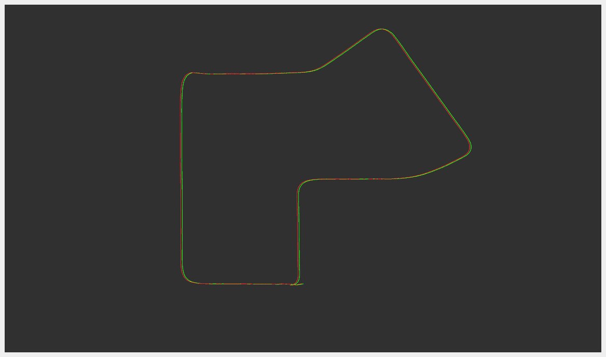
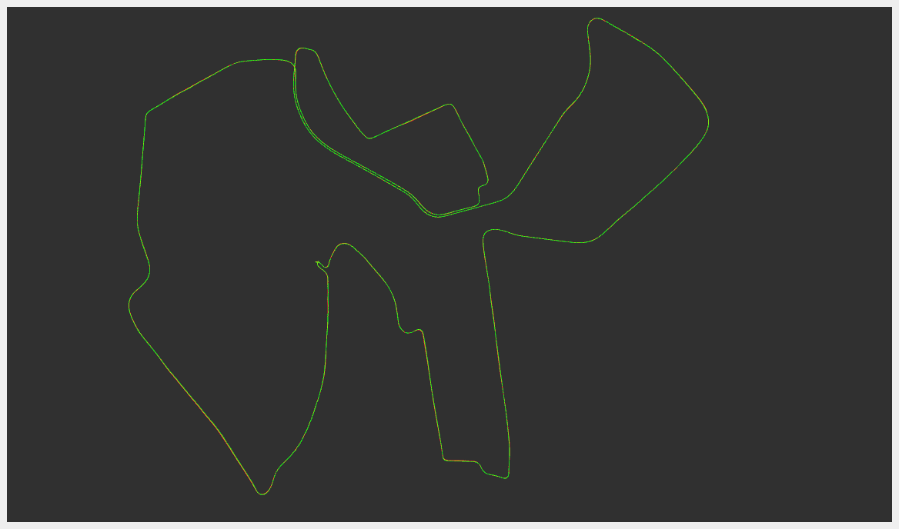

# ESKF IMU-GPS Fusion

An Error-State Kalman Filter (ESKF) implementation for fusing IMU and GPS measurements to achieve robust localization.

## Features

- ESKF-based sensor fusion algorithm
- IMU pre-integration for high-frequency state prediction
- GPS measurement updates for global position correction
- ROS2 compatible implementation
- Tested on public datasets (KITTI and EU Long-term)

## Dependencies

- Ubuntu 20.04 with ROS2 Galactic
- Eigen3
- pcl_ros

## Installation

```bash
mkdir -p eskf_gins_ws/src/
cd eskf_gins_ws/src/
git clone git@github.com:Yaepiii/ESKF_IMU_GPS_Fusion.git
cd ../
colcon build
```

## Testing

The system has been tested on:
- [KITTI dataset](https://www.cvlibs.net/datasets/kitti/)
- [EU Long-term dataset](https://epan-utbm.github.io/utbm_robocar_dataset/)

## Results

| Dataset | Trajectory Comparison |
|---------|-----------------------|
| KITTI 07 |  |
| UTBM |  |

## Parameters

Key configuration parameters (in `config/params.yaml`):

- `log_root`: Result save root path
- `imu_topic`: IMU data topic name
- `gps_topic`: GPS data topic name
- `acc_noise`: Accelerometer noise standard deviation
- `gyro_noise`: Gyroscope noise standard deviation
- `acc_bias_noise`: Accelerometer bias noise
- `gyro_bias_noise`: Gyroscope bias noise
- `I_p_Gps_x`: X-coordinate of GPS w.r.t IMU frame (meters)
- `I_p_Gps_y`: Y-coordinate of GPS w.r.t in IMU frame (meters)
- `I_p_Gps_z`: Z-coordinate of GPS w.r.t in IMU frame (meters)

## TODO

- [ ] Add ROS1 compatibility support
- [ ] Add IMU gravity initial
- [ ] Add support for wheel odometry integration
- [ ] Implement online calibration for IMU-GPS extrinsic parameters
- [ ] Support for more sensor types (LiDAR, camera)

## Contributing

Pull requests are welcome. For major changes, please open an issue first to discuss what you would like to change.
